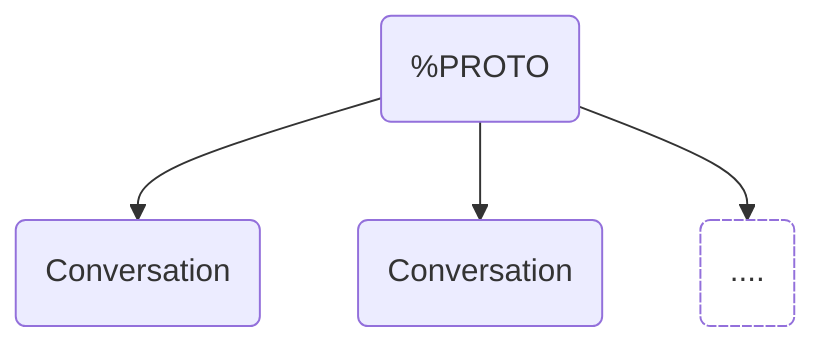

# Abstract

This specification defines a modular communication protocol designed to provide a privacy focused approach to common messaging patterns. The protocol employs a lean root layer that defers to independent sub-protocols for defining communication behavior, with versioning as a first-class concept for handling protocol evolution.

# Background / Rationale / Motivation

Traditionally communication protocols face several critical challenges as they grow. 

Different communication scenarios have vastly different requirements. A protocol optimized for high-volume public broadcasts performs poorly for intimate encrypted conversations, and vice versa. Monolithic protocols cannot optimize for these diverse use cases simultaneously. 

Once widely deployed, communication protocols become difficult to modify. Even minor changes can break compatibility across clients, leading to protocol stagnation and eventually ossification. 

When decentralized protocols do attempt to evolve, versioning becomes a complex negotiation problem. Clients must maintain backward compatibility with multiple protocol versions, leading to bloated implementations and coupling which increases complexity.

At each stage protocols become increasingly difficult to modify, which slows down forward progress.

A preferred approach would be to practice resiliency at the protocol level by focusing on versioning from the beginning.

# Theory / Semantics

This protocol is a lean coordination layer which provides the backbone for smaller independent "Conversation" sub-protocols. Conversation protocols completely define a pathway for communication. This root protocol provides common functionality to support a wide array of communication use cases. 



This protocol is intentionally light, as the work is deferred to the actual conversation protocols.

## Versioning

Incompatible versions of a conversation protocol result in distinct conversationTypes (E.g. PrivateV1 vs PrivateV3). Individual conversationTypes can implement functionality to migrate participants to a conversation. By making this a conversationType issue, different use cases can choose a system that works for them. 


## Conversations 
Conversations can be created permissionlessly within the %PROTO, as there is no required registration. Developers are free to use any given conversation type as long as all intended participants support it.

ConversationTypes MUST adhere to the [Conversations](./conversations.md) specification in order to maintain compatibility, however network adoption is not q requirement.


## Default Inbox
There exists a circular dependency in initializing a Conversation. Conversations require an established conversation to send an invitation, yet at the beginning no channel exists between contacts. 

To resolve this all clients MUST implement a default [Inbox](./inbox.md) to receive initial messages. The default inbox allows clients to discover new conversations asynchronously without prior coordination. By listening in a static location.


The default inbox MUST be configured with the parameters:
- **inbox_addr:** `client_address`
- **discriminator:** "default"

As the clients address is directly linked to the content_topic there is some metadata leakage, and this pathway SHOULD only be used as a last resort.   

## Envelopes
As clients can support multiple sub-protocols simultaneously, a mechanism is required to determine how decode messages.

All payloads sent MUST be deterministically decodable. Deterministic decoding means that clients can always classify a envelope as 1 of 3 states: Readable, BadlyFormed, Addressed to someone else. To support this %PROTO uses an Envelope to link encrypted payloads with the information required to process them. As this payload is sent in the clear the payloads cannot contain any identifiable information.  


### Conversation Hinting
Conversation_ids are sufficient to allow clients to lookup the required encryption parameters and decrypt a message. However this would leak Conversation metadata. Instead a hint is used which allows clients to check if this message is of interest. 

Messages with an unknown hint can be safely disregarded.

ConversationHints are computed by using a salted hash of the `conversationId`. specifically defined as `lowercase_hex(blake2s(conversation_id))`
[TODO: Should conversations define their own hinting?] 


## Wire Format Specification / Syntax

The wire format is specified using protocol buffers v3.

```protobuf

message UmbraEnvelopeV1 {
    
    string conversation_hint = 1;
    uint32 salt = 2;           
    
    EncryptedBytes encrypted_bytes = 10;
}


```

## Implementation Suggestions (optional)

### User level Conversations
A ConversationType defines how to send and receive messages. Developer SHOULD mask the conversationType from users. Developers should use an independent identifier in their apps for user-level "conversations" so that the protocols can update freely. 

## (Further Optional Sections)


## Security/Privacy Considerations

Messages sent to the default inbox are linkable to an client (as it is derived from the clients address). This means that if a target client address is known to an observer, they can determine if any messages were sent to the target using the default inbox.  In this case the Envelopes contain no sender information, so this does not leak social graph information.

Messages inherit the privacy and security properties of the ConversationType used to send them. Please refer to the corresponding specifications when analyzing properties. 

## Copyright

Copyright and related rights waived via [CC0](https://creativecommons.org/publicdomain/zero/1.0/).

## References

A list of references.
