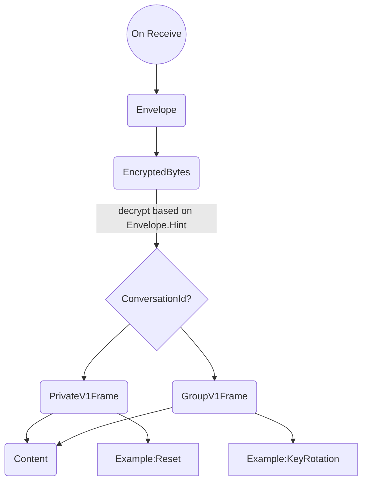

## Abstract

This specification outlines the base message structure for the ChatSDK protocol. 

## Background / Rationale / Motivation
When a client detects a new encrypted message it must determine how to decrypt it. 
It is desired that clients can determine if they are the intended recipient without inferring this from successful decryption. This leads to lost messages with no indication of a problem, such as an out of date client.

One of the most difficult problems in decentralized messaging is managing breaking changes between independent clients. As clients are not always running the latest version they cannot always successfully parse new message types.


## Theory / Semantics


The generic structure of the protocol types follows the Conversations approach outlined [here](https://forum.vac.dev/t/chatsdk-conversations/509). 
The intention is to provide consistent data encapsulation for a wide range of micro-protocols. 





### UmbraEnvelope

The root of the parsing tree is the 'envelope'. 
Its primary role is to aid with payload discovery, which provides a hint as to whether this payload is of interest to the client. 

One approach to do this privately is to include the conversation_id in a wrapping payload which is asymmetrically encrypted using the recipients public_key. This is undesirable for a few reasons:
- Decryption Inefficiency: The message contents are already encrypted, which results in clients having to decrypt twice. 
- Encryption Failure Ambiguity: Clients cannot detect payload errors. This is because decryption faults are indistinguishable from messages intended for another client.
- Poor Scaling: Requiring messages be encrypted per client, conflicts with more efficient payload generation techniques like conversation based addressing.  

Another way is to provide a conversation hint in cleartext, however obscured to stop casual observers from attributing messages to conversations. 
- Hash(Conversation_id + Salt)
- Hash stops casual observers from associating messages to a conversation
- Salt produces a different output for 

[TODO: Define Conversation hint]
[TODO: Highlight privacy impacts]

The data contained here is public and has privacy implications, careful consideration is required.


### EncryptedBytes

The EncryptedBytes message is a self-describing wrapper for all encrypted payloads. As the protocol grows it will include potentially different encryption mechanisms. This message type makes no assumptions about the encryption used an allows new conversation types to use the same messaging framework.


[TODO: Why isn't this defined within the  conversation frames like SDS?]


## Wire Format Specification / Syntax
The key words “MUST”, “MUST NOT”, “REQUIRED”, “SHALL”, “SHALL NOT”, “SHOULD”, “SHOULD NOT”, “RECOMMENDED”, 
“NOT RECOMMENDED”, “MAY”, and “OPTIONAL” in this document are to be interpreted as described in [RFC 2119](https://www.ietf.org/rfc/rfc2119.txt).

This section SHOULD not contain explanations of semantics and focus on concisely defining the wire format.
Implementations SHOULD adhere to these exact formats to interoperate with other implementations.
It is fine, if parts of the previous section that touch on the wire format are repeated.
The purpose of this section is having a concise definition of what an implementation sends and accepts.
Parts that are not specified here are considered implementation details. 
Implementors are free to decide on how to implement these details.


The wire format is specified using protocol buffers v3.

```mermaid

message UmbraEnvelopeV1 {
    
    string conversation_hint = 1;
    uint32 nonce = 2;           
    
    EncryptedBytes encrypted_bytes = 100;
}

message EncryptedBytes {

    oneof encryption {
        bytes encrypted_bytes=1;
        Plaintext plaintext = 2;
		Ecies ecies = 3;
    }
   
    
    message Ecies {
        bytes encrypted_bytes=1;
        bytes ephemeral_pubkey = 2;
        bytes tag = 3;
        
    }

    message Plaintext {
        bytes payload=1;
    }
}

```


## Implementation Suggestions (optional)
An optional *implementation suggestions* section may provide suggestions on how to approach implementation details, and, 
if available, point to existing implementations for reference.


## (Further Optional Sections)


## Security/Privacy Considerations


## Copyright

Copyright and related rights waived via [CC0](https://creativecommons.org/publicdomain/zero/1.0/).

## References

A list of references.