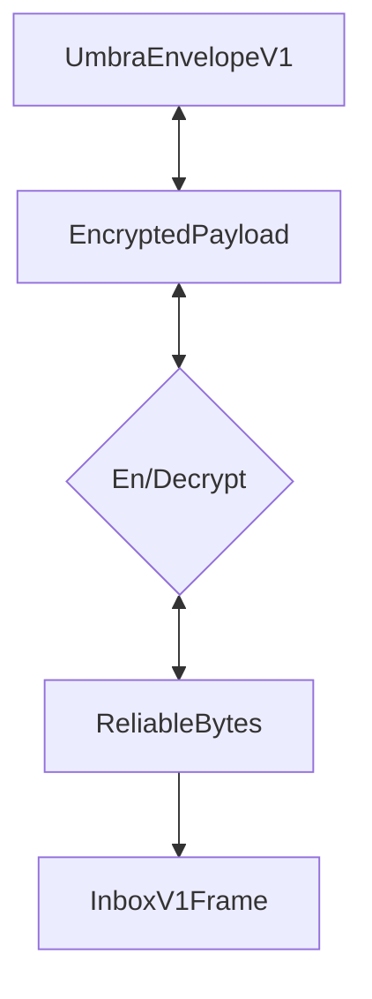

# Abstract


# Background / Rationale / Motivation
Clients must be able to receive frames before conversations can be initialized. While its possible to coordinate a content topic out of band, that becomes limiting factor to growth. 


# Theory / Semantics

Inboxes are inbound only conversation types, which allow a client to receive messages from contacts. 
An inbox does not have a defined set of participants, and is used to receive messages when there is not an established channel between contacts. 

An inbox does not have an inherent keypair or identity associated with it - it's an agreed upon location to receive messages. 

Inboxes are not exclusive to a single account, and can be used by many different accounts. It is expected  


## Invitations / Initialization

Inboxes do not require coordination with other clients because they are inbound only. 

However to receive messages at this inbox, remote clients must know this is a valid place to receive messages. This can be statically defined in a conversation protocol or communicated out of band.

## Inbox Identifiers

Inboxes are Identified by a 

Inboxes do not need to be "created", and there is no required initialization. 


## Content Topic Usage

// TODO: Inbox Topics will be defined in ContactBundles, allowing for dynamic topic usage
All clients must listen for messages posted with the content topic `/inbox/<inbox_address>`

`lower_hex(hash(/inbox/<inbox_address>)`


## Accepted types


## Encryption

All Frames sent to the Inbox MUST be encrypted to maintain message confidentiality. 

This protocol uses a reversed variant of the [KN noise handshake](https://noiseexplorer.com/patterns/KN/) to secure inbound messages.

 ```noise
KNfallback:
  <- e, s
  ...
  -> e, ee, es	
 ```

In this case the responder provides both `s` and `e` out of band. 

The handshakes primary purpose is to provide sender confidentiality, with some forward secrecy. The handshake is similar to a one way N handshake with a recipient side ephemeral key.   

Note this channel does not not provide sender authentication, and should only be used to implement a confidential message delivery with some forward secrecy. This limitation is intentional to maintain O-RTT encryption. As this is an inbound pathway further messages to establish mutual authentication with identity hiding would be wasteful. 

### Ciphersuite

The noise handshake is implemented with the following functions:

**DH:** X25519
**cipher:** AEAD_CHACHA20_POLY1305 
**hash:** BLAKE2s 

The noise protocol name would then be `Noise_KNfallback_25519_ChaChaPoly_BLAKE2s`

This protocol opts for 32bit variants to optimize for mobile and resource constrained environments.

### Endianness
[TODO: The Noiseprotocol specification recommends BigEndian length fields - Need to define if this protocol will deviate]

## Framing 

[TODO: Is there benefit to using SDS in this case? If all messages are invites and communication occurs else where, is this just wasting bytes?]


### EncryptedBytes

The EncryptedBytes message is a self-describing wrapper for all encrypted payloads. This message type makes no assumptions about the encryption used an allows new conversation types to use the same messaging framework.

As this protocol uses the KN noise handshake, the encoding wrapper uses the corresponding type. 


## Wire Format Specification / Syntax
The wire format is specified using protocol buffers v3.

```protobuf

message InboxV1Frame {
    string recipient = 1;
    oneof frame_type {
        ... supported invite types
    }
}

message EncryptedPayload {

    oneof encryption {
		NoiseKN noise_KN = 3;
    }
   
    message NoiseKN {
        bytes encrypted_bytes = 1;
        bytes ephemeral_pubkey = 2;
    }
}

```


## Security/Privacy Considerations

### Sender Auth
The encryption scheme used does not provide any sender authentication. Messages sent over this pathway need to validate the sender before trusting any of the contents.

### EncryptedPayload metadata leakage
Encrypted bytes themselves are not encrypted so its fields are visible to all observers. Through analytical means observers can determine the type of message being sent, by looking at what fields are present, and the relative size of the payload. This is true regardless of whether the encrypted bytes are wrapped in a EncryptedPayload object. Wrapping the payload allows for better support into the future without meaningful changing the metadata leakage. 

## Copyright

Copyright and related rights waived via [CC0](https://creativecommons.org/publicdomain/zero/1.0/).

## References

A list of references.
