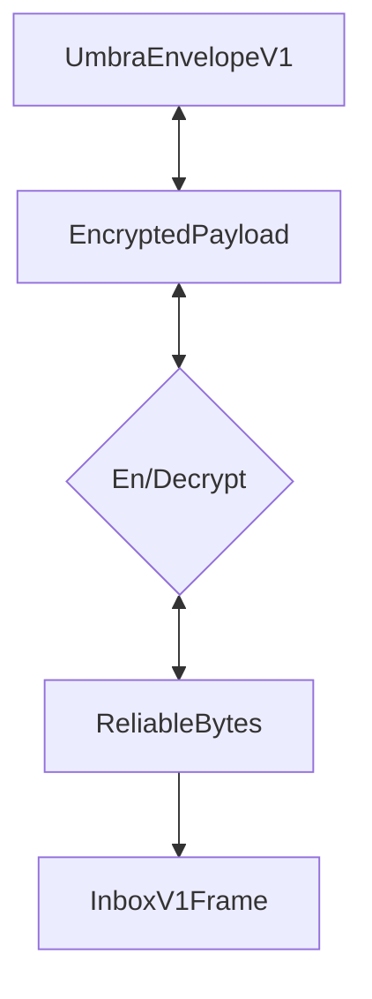

# Abstract


# Background / Rationale / Motivation
Clients must be able to receive frames before conversations can be initialized. While its possible to coordinate a content topic out of band, that becomes limiting factor to growth. 


# Theory / Semantics

Inboxes are inbound only conversation types, which allow a client to receive messages from contacts. 
An inbox does not have a defined set of participants, and is used to receive messages when there does not exist and established channel between contacts. 

An inbox does not have an inherent keypair or identity associated with it - it's an agreed upon location to recieve messages. 


## Creation

Inboxes do not need to be "created", and there is no required initialization. 


## Content Topic

// TODO: Inbox Topics will be defined in ContactBundles, allowing for dynamic topic usage
All clients must listen for messages posted with the content topic `/inbox/<inbox_address>`


## Accepted types


## Encryption

All Frames sent to the Inbox MUST be encrypted to maintain message confidentiality. 

This protocol uses a [KN noise handshake](https://noiseexplorer.com/patterns/KN/) to secure inbound messages. 

Recipients S,E is sent out of band. Messages sent in this manner do not benefit from sender authentication. Contents need to be validated prior to being trusted. 


## Framing 

[TODO: Is there benefit to using SDS in this case? If all messages are invites and communication occurs else where, is this just wasting bytes?]


### EncryptedBytes

The EncryptedBytes message is a self-describing wrapper for all encrypted payloads. As the protocol grows it will include potentially different encryption mechanisms. This message type makes no assumptions about the encryption used an allows new conversation types to use the same messaging framework.


## Wire Format Specification / Syntax
The wire format is specified using protocol buffers v3.

```protobuf

message InboxV1Frame {
    string recipient = 1;
    oneof frame_type {
        ... supported invite types
    }
}

message EncryptedBytes {

    oneof encryption {
        bytes encrypted_bytes=1;
        Plaintext plaintext = 2;
		Ecies ecies = 3;
    }
   
    
    message Ecies {
        bytes encrypted_bytes=1;
        bytes ephemeral_pubkey = 2;
        bytes tag = 3;
        
    }

    message Plaintext {
        bytes payload=1;
    }
}

```

## Implementation Suggestions (optional)
An optional *implementation suggestions* section may provide suggestions on how to approach implementation details, and, 
if available, point to existing implementations for reference.


## (Further Optional Sections)


## Security/Privacy Considerations


## Copyright

Copyright and related rights waived via [CC0](https://creativecommons.org/publicdomain/zero/1.0/).

## References

A list of references.
